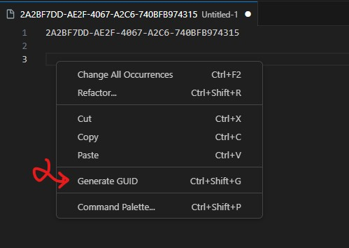

# GuidGenerator - Visual Studio Code Extension

Generate and insert GUIDs (uuid) effortlessly into your code using a simple shortcut.

## Features

- Quickly generate and insert GUIDs into your code.
- Streamline your workflow with a convenient keyboard shortcut.
- You can use in multiple lines.

## Requirements

- [Visual Studio Code](https://code.visualstudio.com)

## Installation

1. Launch Visual Studio Code.
2. Go to the Extensions view by clicking on the square icon in the sidebar or pressing `Ctrl+Shift+X`.
3. Search for "GuidGenerator" and click Install.
- [Marketplace](https://marketplace.visualstudio.com/items?itemName=kocdev.guidgenerator)

## Settings

1. Go to keyboard shortcuts on VS Code (`Ctrl+K+S`)
    - Windows: File > Preferences > Keyboard Shortcuts
    - macOS: Code > Settings > Keyboard  Shortcuts
2. Find `extension.generateGuid` and set custom shortcut

## Usage

1. Open a file in which you want to insert a GUID.
2. Place your cursor at the desired insertion point.
3. Press `Ctrl+Alt+G` (or your custom shortcut) to generate and insert a new GUID.

## Visual Studio Extension

Those who use Visual Studio can see this plugin made for Visual Studio with the plugin here.
- [VS Guid Generator Extension](https://github.com/vs-guid-generator)

## Contributing

Contributions are welcome! Please fork this repository and submit pull requests.

## License

This project is licensed under the [MIT License](LICENSE).

---

**Enjoy!**
